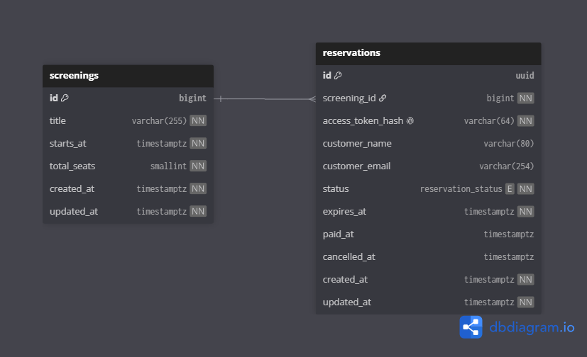

# Сinema-ticket-api

Backend для тестового задания сервиса продажи билетов в кино.

Сервис показывает список киносеансов с количеством свободных мест, создаёт временную бронь на время оплаты, подтверждает оплату и освобождает место при отмене или истечении срока брони.

## Возможности

* список будущих киносеансов с актуальным количеством свободных мест
* временная бронь места на 2 минуты
* имитация успешной оплаты
* отмена временной брони при закрытии формы
* автоматическое истечение неиспользованных броней
* защита от конкурентного бронирования последнего места
* API без авторизации
* Docker-окружение с PostgreSQL, Redis, Nginx и PHP-FPM

## Стек

* PHP 8.3
* Laravel 12
* PostgreSQL 16
* Redis 7
* Nginx
* Docker Compose
* Pest
* Laravel Pint

## Быстрый запуск

### Требования

* Docker Desktop с включённой интеграцией WSL
* Docker Compose

### 1. Подготовить окружение

```bash
cp .env.example .env
```

Проверь, что в `.env` указаны настройки:

```env
APP_NAME="Cinema Ticket API"
APP_ENV=local
APP_DEBUG=true
APP_URL=http://localhost:8080

FRONTEND_URL=http://localhost:3000

DB_CONNECTION=pgsql
DB_HOST=postgres
DB_PORT=5432
DB_DATABASE=cinema_ticket
DB_USERNAME=cinema
DB_PASSWORD=cinema_secret

CACHE_STORE=redis
SESSION_DRIVER=file
QUEUE_CONNECTION=sync

REDIS_CLIENT=phpredis
REDIS_HOST=redis
REDIS_PASSWORD=null
REDIS_PORT=6379
```

### 2. Собрать и запустить контейнеры

```bash
docker compose up -d --build
```

### 3. Применить миграции и загрузить тестовые сеансы

```bash
docker compose exec app php artisan migrate:fresh --seed
```

API будет доступно по адресу:

```text
http://localhost:8080/api/v1
```

Проверка работоспособности:

```bash
curl http://localhost:8080/api/v1/health
```

Ожидаемый ответ:

```json
{
  "status": "ok"
}
```

## Контейнеры

| Сервис      | Назначение                                 |
| ----------- | ------------------------------------------ |
| `nginx`     | принимает HTTP-запросы на `localhost:8080` |
| `app`       | Laravel и PHP-FPM                          |
| `scheduler` | запускает Laravel Scheduler                |
| `postgres`  | основная PostgreSQL-база                   |
| `redis`     | кэш и distributed locks для scheduler      |

Проверить состояние:

```bash
docker compose ps
```

Просмотреть логи:

```bash
docker compose logs -f app
docker compose logs -f nginx
docker compose logs -f scheduler
```

Остановить окружение:

```bash
docker compose down
```

Полностью удалить контейнеры, volumes и данные PostgreSQL:

```bash
docker compose down -v
```

## Тесты и форматирование

Для Feature-тестов используется отдельная база `cinema_ticket_test`.

Создать её один раз:

```bash
docker compose exec postgres psql -U cinema -d postgres \
  -c "CREATE DATABASE cinema_ticket_test OWNER cinema;"
```

Если база уже существует, PostgreSQL сообщит об этом. Это нормально.

Запуск всех тестов:

```bash
docker compose exec app ./vendor/bin/pest
```

Только unit-тесты:

```bash
docker compose exec app ./vendor/bin/pest --testsuite=Unit
```

Проверка форматирования:

```bash
docker compose exec app ./vendor/bin/pint --test
```

Автоматическое исправление форматирования:

```bash
docker compose exec app ./vendor/bin/pint
```

## API

Все ответы возвращаются в JSON. Все даты передаются в ISO 8601 и UTC.

Базовый URL:

```text
http://localhost:8080/api/v1
```

### Получить список сеансов

```http
GET /screenings
```

Пример ответа:

```json
[
  {
    "id": 1,
    "title": "Интерстеллар",
    "startsAt": "2026-06-26T16:00:00Z",
    "totalSeats": 10,
    "availableSeats": 8
  }
]
```

`availableSeats` рассчитывается на backend и учитывает:

* оплаченные брони
* активные временные брони
* истёкшие и отменённые брони не занимают места

### Создать временную бронь

Вызывается в момент нажатия пользователем на кнопку оформления билета.

```http
POST /screenings/{screeningId}/reservations
Accept: application/json
```

Тело запроса не требуется.

Успешный ответ `201 Created`:

```json
{
  "id": "56f96ec8-8bd9-41dc-9c34-a785dfdb9f6e",
  "reservationToken": "секретный-токен-из-64-символов",
  "expiresAt": "2026-06-26T16:02:00Z"
}
```

Возможные ошибки:

| Код   | Причина                    |
| ----- | -------------------------- |
| `404` | сеанс не найден            |
| `409` | сеанс уже начался          |
| `409` | свободных мест не осталось |

### Подтвердить оплату

Реальный эквайринг в рамках тестового задания не подключён. Запрос имитирует успешную оплату.

```http
POST /reservations/{reservationId}/pay
Accept: application/json
Content-Type: application/json
X-Reservation-Token: {reservationToken}
```

Тело:

```json
{
  "name": "Иван Иванов",
  "email": "ivan@example.com"
}
```

Успешный ответ `200 OK`:

```json
{
  "id": "56f96ec8-8bd9-41dc-9c34-a785dfdb9f6e",
  "status": "paid",
  "paidAt": "2026-06-26T16:01:15Z"
}
```

Ограничения валидации:

* имя от 2 до 80 символов
* email в корректном формате, максимум 254 символа
* `X-Reservation-Token` обязателен и должен содержать 64 hex-символа

### Отменить временную бронь

Вызывается при закрытии формы до оплаты.

```http
DELETE /reservations/{reservationId}
Accept: application/json
X-Reservation-Token: {reservationToken}
```

Успешный ответ `200 OK`:

```json
{
  "id": "56f96ec8-8bd9-41dc-9c34-a785dfdb9f6e",
  "status": "cancelled"
}
```

Если пользователь закрыл вкладку и запрос не успел выполниться, место автоматически освободится после истечения срока брони.

## Формат ошибок

Ошибки валидации Laravel возвращаются в формате:

```json
{
  "message": "The given data was invalid.",
  "errors": {
    "name": [
      "The name field is required."
    ]
  }
}
```

Ошибки бизнес-правил:

```json
{
  "message": "Свободных мест на сеанс не осталось."
}
```

## Архитектура

Проект разделён на четыре слоя:

```text
app/
├── Domain/
├── Application/
├── Infrastructure/
└── Presentation/
```

### Domain

Содержит чистые бизнес-правила и не зависит от Laravel.

Примеры:

* статусы брони `pending`, `paid`, `expired`, `cancelled`
* проверка срока действия брони
* переход брони в статус оплаты или отмены
* проверка доступности мест
* запрет бронирования прошедшего сеанса

### Application

Содержит сценарии системы и контракты, через которые сценарии обращаются к внешнему миру.

Примеры:

* создание временной брони
* оплата брони
* отмена брони
* истечение брони
* список сеансов

Application не знает о Eloquent, HTTP-контроллерах и конкретной базе данных.

### Infrastructure

Содержит технические реализации контрактов Application.

Примеры:

* Eloquent-модели
* PostgreSQL-запросы
* `SELECT ... FOR UPDATE`
* генерация UUID
* генерация токенов
* Redis и Laravel Scheduler
* транзакции Laravel

### Presentation

Содержит внешние точки входа.

Примеры:

* HTTP-контроллеры
* Form Request
* JSON Resource
* Artisan-команда очистки броней

Направление зависимостей:

```text
Presentation → Application → Domain
Infrastructure → Application
```

Eloquent-модели намеренно находятся только в `Infrastructure`, потому что они являются техническим представлением данных в PostgreSQL, а не бизнес-моделью.

## Схема базы данных

Документация схемы находится в файле:

```text
docs/database.dbml
```



Его можно вставить в [dbdiagram.io](https://dbdiagram.io).

В базе есть две основные таблицы:

```text
screenings
reservations
```

`screenings` хранит название сеанса, время начала и общий лимит мест.

`reservations` хранит бронь, её статус, срок действия, данные покупателя и SHA-256 хэш токена управления бронью.

Токен возвращается клиенту только при создании брони. В базе хранится только его хэш.

## Конкурентное бронирование

Ключевая задача проекта - не допустить, чтобы несколько пользователей заняли одно последнее место.

При создании брони выполняется следующий сценарий внутри одной транзакции:

```text
начать транзакцию
→ заблокировать строку сеанса через SELECT FOR UPDATE
→ пометить истёкшие pending-брони как expired
→ посчитать занятые места
→ проверить лимит мест
→ создать новую pending-бронь
→ завершить транзакцию
```

Все операции, влияющие на бронь, используют одинаковый порядок блокировки:

```text
screening → reservation
```

Это исключает ситуацию, когда два параллельных запроса одновременно увидят последнее свободное место.

Проверка доступности не хранится в отдельном поле `available_seats`. Значение всегда рассчитывается из общего лимита сеанса и активных броней, поэтому не может рассинхронизироваться.

## Истечение брони

Временная бронь действует 2 минуты.

Даже если фоновая очистка временно не сработала, бронь перестаёт занимать место сразу после `expires_at`.

Laravel Scheduler раз в минуту запускает команду:

```bash
php artisan reservations:expire
```

Она переводит все просроченные `pending`-брони в статус `expired`.

Проверить расписание:

```bash
docker compose exec app php artisan schedule:list
```

Запустить очистку вручную:

```bash
docker compose exec app php artisan reservations:expire
```

## Интеграция frontend

В `.env.local` frontend необходимо указать:

```env
NEXT_PUBLIC_API_URL=http://localhost:8080/api/v1
```

Frontend должен работать по следующему сценарию:

```text
Нажатие «Оформить билет»
→ POST /screenings/{id}/reservations
→ получить reservationToken
→ открыть форму и показать таймер

Нажатие «Оплатить»
→ POST /reservations/{id}/pay
→ показать успешный результат
→ не отправлять DELETE

Закрытие формы до оплаты
→ DELETE /reservations/{id}
→ обновить список сеансов
```

## Что намеренно не реализовано

В рамках тестового задания не добавлялись:

* авторизация пользователей
* реальная интеграция с эквайрингом
* выбор конкретного кресла
* личный кабинет
* email-уведомления
* сложный дизайн интерфейса

Эти ограничения соответствуют требованиям тестового задания и не влияют на основной сценарий безопасного временного бронирования.
